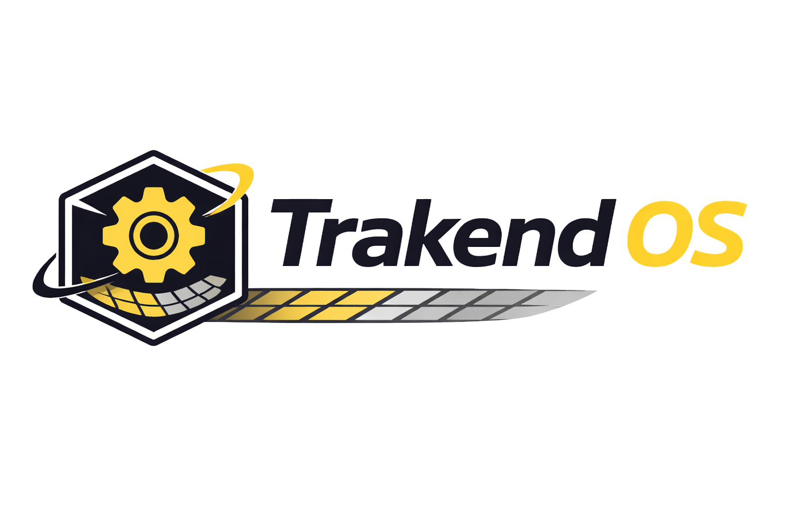

# Trakend OS

**Server Management Platform** — A powerful, self-hosted server operating system with AI-powered monitoring, Docker container management, and a beautiful web-based GUI.



---

## Features

- **System Dashboard** — Real-time monitoring of CPU (per-core), RAM, GPU, all drives (SMART health), and network interfaces
- **Docker Management** — Full container lifecycle with right-click settings, live resource stats, log viewer, and an App Store with 20+ pre-configured self-hosted apps
- **Built-in MariaDB** — Auto-deployed MySQL-compatible database server with a full management UI (query editor, table browser, user management)
- **Multi-Tab Terminal** — Browser-based PTY terminal with multiple tabs, full color support
- **Maya AI Assistant** — Built-in AI that monitors system health 24/7, detects issues before they happen, performs auto-healing, and sends intelligent notifications
- **Event Logging** — Comprehensive logging with severity levels, source filtering, pattern detection, and predictive issue identification
- **Theme Customization** — Full color customization, dark/light modes, preset themes
- **Git-Based Updates** — Server checks this repo daily for updates with one-click install
- **USB Installer** — Flash to USB stick, boot, and install on any x86_64 server

## Quick Start

### Option 1: Install on Existing Linux Server

```bash
git clone https://github.com/joeabillion/TRAKENDOS.git
cd TRAKENDOS
sudo ./scripts/install.sh
```

### Option 2: USB Flash Install

```bash
# Create bootable USB installer
sudo ./scripts/create-usb-installer.sh /dev/sdX
```

### Option 3: Docker Compose

```bash
git clone https://github.com/joeabillion/TRAKENDOS.git
cd TRAKENDOS
docker compose up -d
```

### Option 4: Development Mode

```bash
git clone https://github.com/joeabillion/TRAKENDOS.git
cd TRAKENDOS
node scripts/setup.js
npm run dev
```

## Default Credentials

| Field | Value |
|-------|-------|
| Username | `admin` |
| Password | `trakend` |
| MySQL Root | `trakend_db_root` |

**Change these immediately after first login!**

## Architecture

| Component | Technology | License |
|-----------|-----------|---------|
| Backend | Node.js + TypeScript + Express + WebSocket | MIT |
| Frontend | React + TypeScript + Vite + TailwindCSS | MIT |
| Database (internal) | SQLite (WAL mode) | MIT |
| Database (user) | MariaDB 11 (auto-deployed) | MIT |
| Container Engine | Docker via dockerode | Apache 2.0 |
| Terminal | node-pty + xterm.js | MIT |
| System Monitoring | systeminformation | MIT |
| AI Assistant | Rule-based + Knowledge Base (Ollama-ready) | MIT |

All dependencies use MIT, Apache 2.0, BSD, or ISC licenses — **fully cleared for commercial use**.

## Maya AI Assistant

Maya is the built-in AI operations assistant. She:

- Monitors CPU, RAM, disk, GPU, network, and Docker health 24/7
- Detects issues before they become problems (predictive monitoring)
- Sends actionable notifications with one-click investigation
- Performs auto-healing (restarts crashed services, rotates logs, cleans zombies)
- Suggests optimizations (right-size containers, tune system settings)
- Finds duplicate files and suggests cleanup
- Follows strict safety rules (never deletes without permission)

## Updates

Trakend OS checks this repository daily for new versions. When an update is available:

1. A notification badge appears in the top bar
2. Maya sends a notification with the changelog
3. Go to **Settings > Updates** to review and apply

Updates are applied via `git pull` — your data and settings are preserved.

## License

MIT License — Free for personal and commercial use.

---

Built with care by Trakend OS Team
